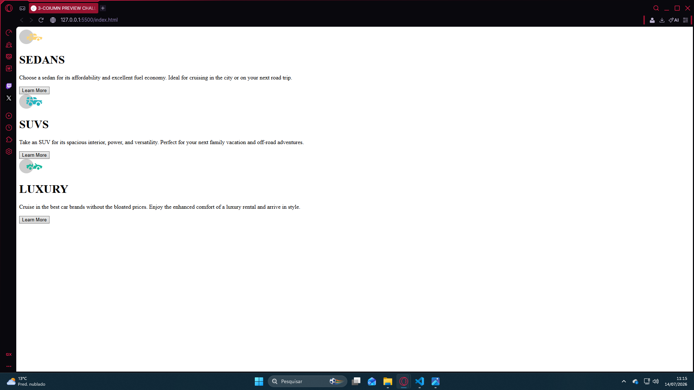
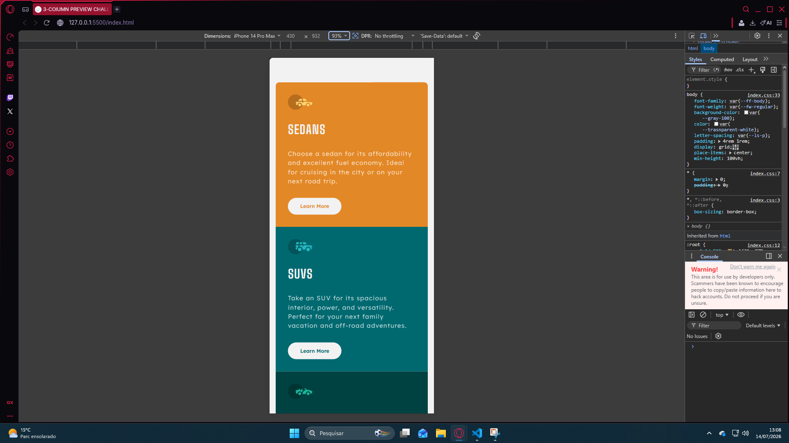
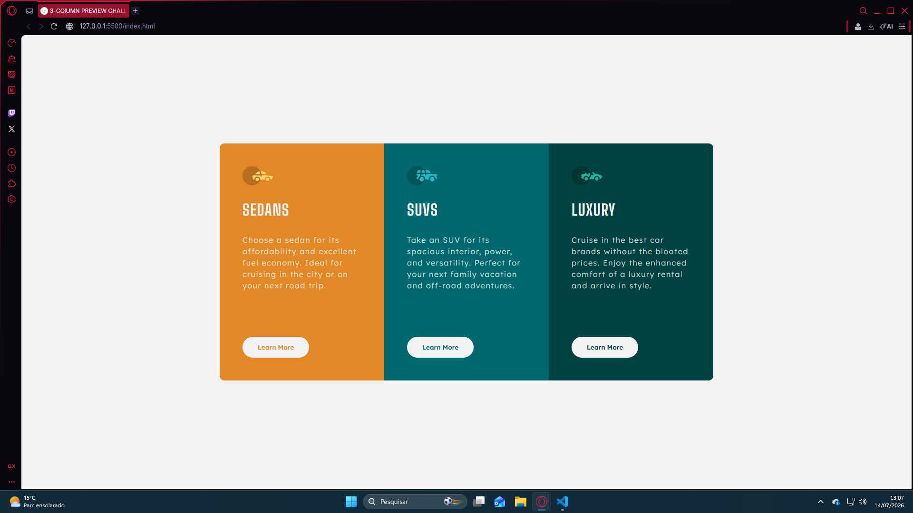

# Frontend Mentor - 3-column preview card component solution

This is a solution to the [3-column preview card component challenge on Frontend Mentor](https://www.frontendmentor.io/challenges/3column-preview-card-component-pH92eAR2-). Frontend Mentor challenges help you improve your coding skills by building realistic projects. 

## Table of contents

- [Overview](#overview)
  - [The challenge](#the-challenge)
  - [Screenshot](#screenshot)
  - [Links](#links)
- [My process](#my-process)
  - [Built with](#built-with)
  - [What I learned](#what-i-learned)
  - [Continued development](#continued-development)

## Overview

### The challenge

Users should be able to:

- View the optimal layout depending on their device's screen size
- See hover states for interactive elements

### Screenshot

### Links

- Solution URL: (https://github.com/henriquealfredobenettidesousa-blip/3-COLUMN-PREVIEW-CARD)
- Live Site URL: (https://henriquealfredobenettidesousa-blip.github.io/3-COLUMN-PREVIEW-CARD/)

## My process

### Built with

- Semantic HTML5 markup
- CSS custom properties
- Flexbox
- CSS Grid
- Mobile-first workflow
- Responsiveness Layout

### What I learned

This project helped me become more comfortable with the mobile-first approach. Instead of creating the desktop layout first and adapting it later, I built the mobile version as the foundation and progressively enhanced it for larger screens.

I also focused on improving the responsiveness of the layout, making sure the component looked good on different screen sizes while maintaining the original design as closely as possible.

Additionally, I practiced creating reusable CSS classes for shared card styles while keeping each card's unique properties separate. This project also reinforced the importance of writing semantic HTML and organizing my code with clearer class names.

### Continued development

I want to continue improving my semantic HTML, especially choosing the most appropriate elements for different types of content.

I also want to keep refining my responsive layouts so that transitions between different screen sizes feel more natural and consistent.
